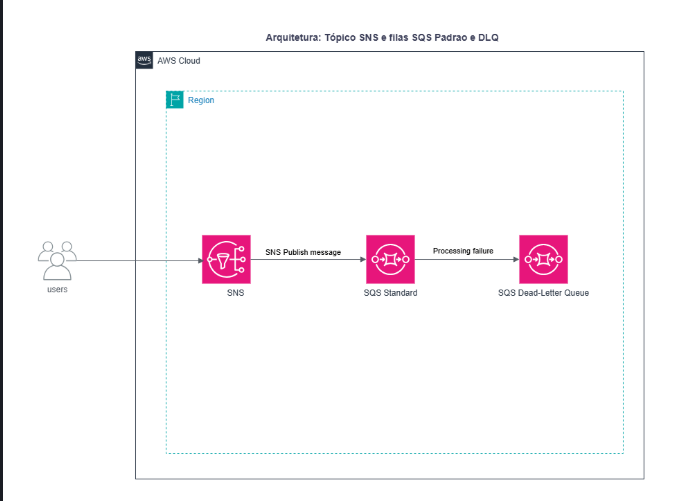
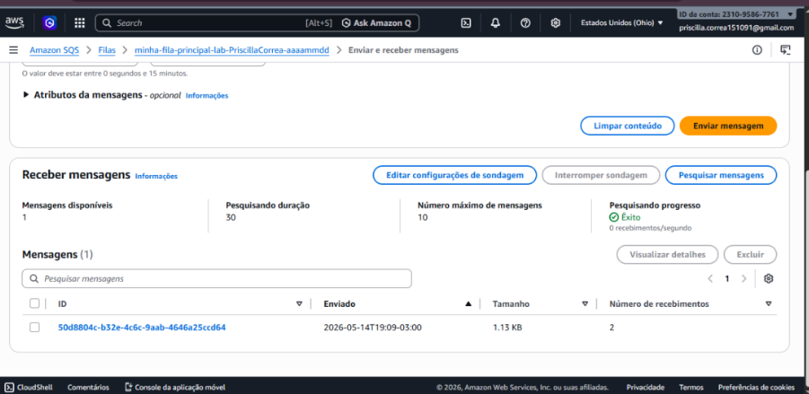
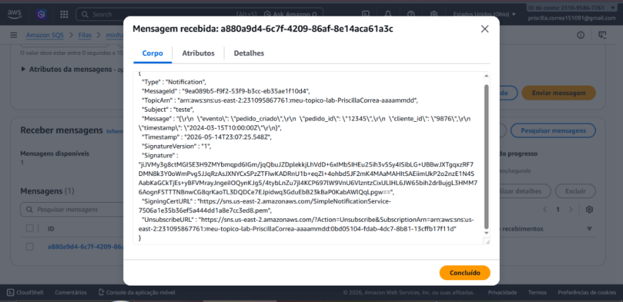

# 🚀 Pipeline de Mensageria Resiliente com Amazon SNS e SQS

## 📌 Visão Geral do Projeto
Este projeto apresenta uma arquitetura **Event-Driven (Baseada em Eventos)** implementada na AWS. O objetivo principal é demonstrar o **desacoplamento de sistemas**, garantindo que as mensagens sejam processadas de forma assíncrona, segura e escalável.

---

## 🏗️ Arquitetura da Solução
Abaixo, o diagrama da estrutura que montei utilizando serviços Serverless:



### 🛠️ Componentes e Funções:
* **Amazon SNS (Simple Notification Service):** Utilizado para implementar o padrão *Fan-out*, distribuindo mensagens simultaneamente para múltiplos destinos.
* **Amazon SQS (Simple Queue Service):** Atua como um *buffer* de persistência. Ele garante que, mesmo em picos de tráfego, nenhuma mensagem seja perdida.
* **AWS Lambda:** Executa a lógica de negócio assim que uma nova mensagem chega à fila.

---

## 🔐 Configuração de Segurança (Access Policy)

Para que o SNS tenha permissão de entregar mensagens na fila SQS, configurei a seguinte política de acesso baseada em recursos:

```json
{
  "Version": "2012-10-17",
  "Statement": [
    {
      "Effect": "Allow",
      "Principal": { "Service": "sns.amazonaws.com" },
      "Action": "sqs:SendMessage",
      "Resource": "arn:aws:sqs:us-east-1:123456789012:FilaPrincipal",
      "Condition": {
        "ArnEquals": { "aws:SourceArn": "arn:aws:sns:us-east-1:123456789012:TopicoNotificacoes" }
      }
    }
  ]
}
```

---

## 🛠 Configuração de Resiliência (DLQ)
Para garantir que nenhuma mensagem fosse perdida em caso de falha, configurei uma Dead Letter Queue (DLQ).

Tentativas: Defini o limite de 3 tentativas de processamento.

Comportamento: Na 4ª tentativa sem sucesso, a mensagem é automaticamente movida para a "fila morta" (DLQ), onde pude realizar a consulta para comprovar que o fluxo de erro funcionou conforme o esperado.

---

## 🚀 Desafios Técnicos Resolvidos
1.  **Resiliência:** Implementação de filas para evitar perda de dados em caso de falha no processador.
2.  **Escalabilidade:** A arquitetura suporta o aumento de demanda sem necessidade de intervenção manual.
3.  **Segurança (IAM):** Aplicação do princípio do menor privilégio nas *Access Policies* do SQS e SNS.

---

## 📸 Demonstração do Laboratório
Aqui estão as evidências da implementação e dos testes realizados com sucesso no console AWS:

### 1. Configuração do Tópico SNS e Filas SQS


### 2. Validação do Fluxo de Mensagens


---

## 💻 Como Reproduzir
1. Configure um tópico padrão no Amazon SNS.
2. Crie duas filas SQS e faça a assinatura (Subscription) no tópico.
3. Configure as permissões de acesso para permitir o `SendMessage` vindo do SNS.
4. (Opcional) Conecte uma função Lambda para processar os itens da fila.
5. Durante a configuração das filas, implementei uma Redrive Policy definindo um maxReceiveCount de 3. Isso significa que, após a 3ª tentativa frustrada de leitura, a mensagem é automaticamente movida para uma Dead Letter Queue (DLQ), evitando o processamento infinito de mensagens inválidas e garantindo a saúde do sistema.


